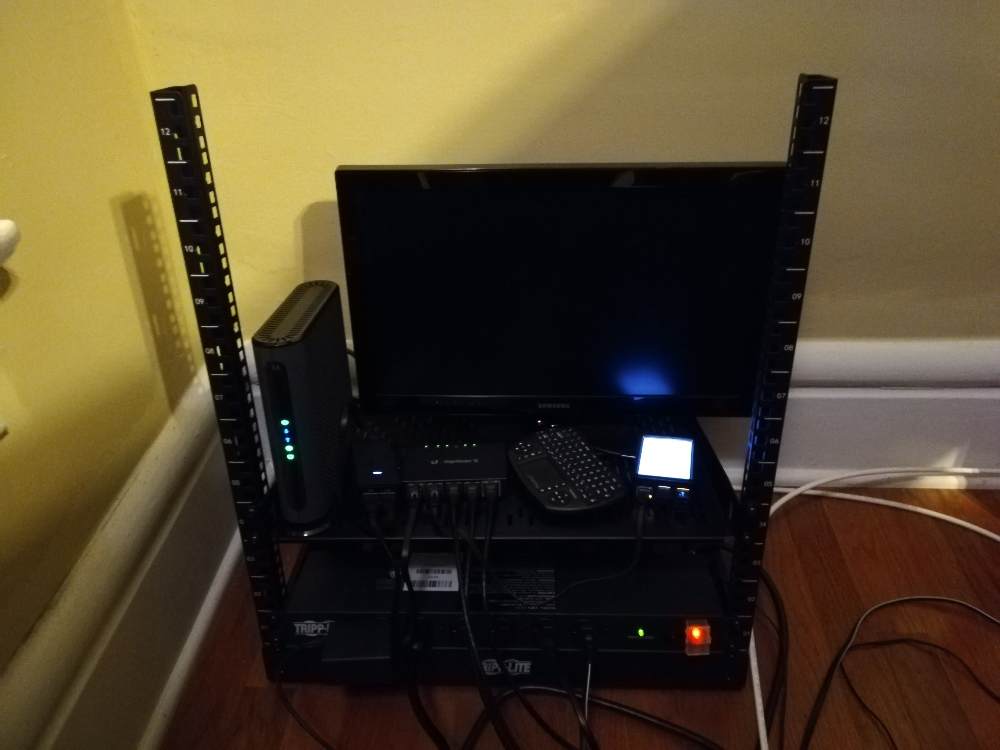
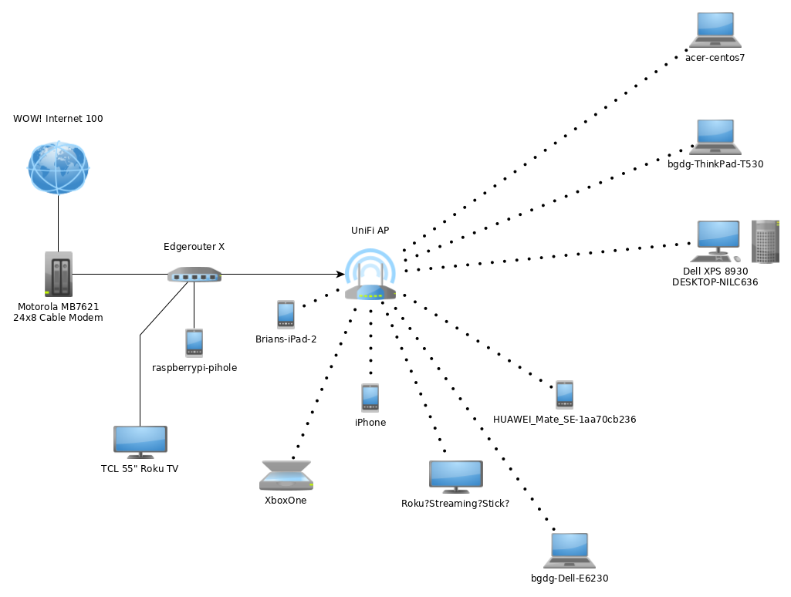

title: Humble Homelab Beginnings
tags:
- homelab
- devops
categories:
- Development
author: ''
date: 2019-10-15
---
Since moving from Big Data development to a DevOps/Cloud Engineering role at work, I've been diving into a lot of topics that are new to me - networking, virtualization, configuration management, Linux System Adminstration, DNS, etc. In an effort to strengthen my knowledge in these areas, I've been looking for ways to put them to use at home. So with that in mind, I decided the beginnings of a proper [homelab](https://www.reddit.com/r/homelab/) setup were in order. Step 1: Upgrade from our ISP-provided modem/router combo to some quality home networking equipment.

<!--  -->

    

        

            
        

        

            
        

    

In place of the combo we now have:
- [Motorola MB7621 24x8 Cable Modem](https://motorolanetwork.com/mb7621.html)
- [Edgerouter X](https://www.ui.com/edgemax/edgerouter-x/)
- [UniFi AP-AC-Lite](https://www.ui.com/unifi/unifi-ap-ac-lite/)
- [Raspberry Pi 3 Model B+](https://www.raspberrypi.org/products/raspberry-pi-3-model-b-plus/) with [Pi-hole](https://pi-hole.net/) setup for network-wide ad blocking.

So far I've been happy with the new setup. I've got a few enhancements planned, starting with multiple VLANs for network separation and a guest WiFi network.

<!--  -->