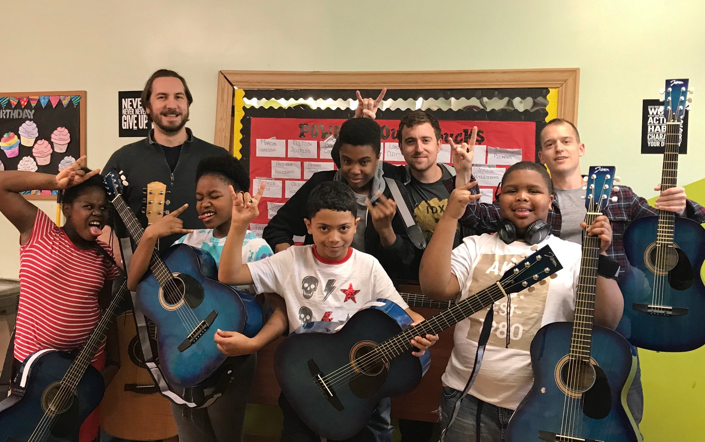
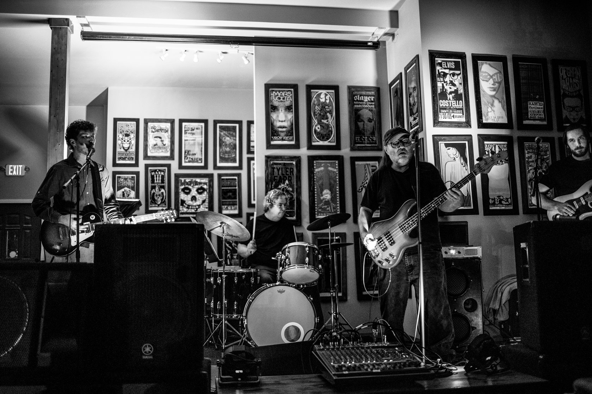
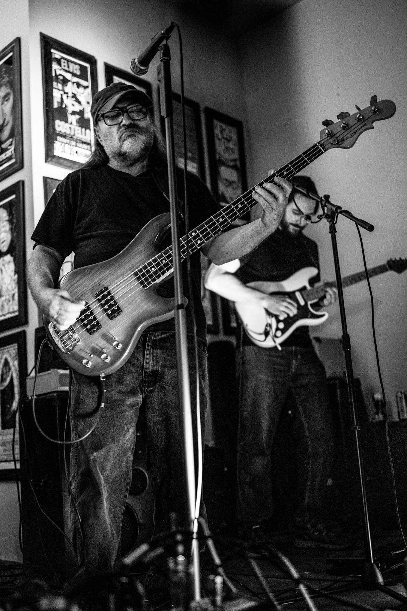
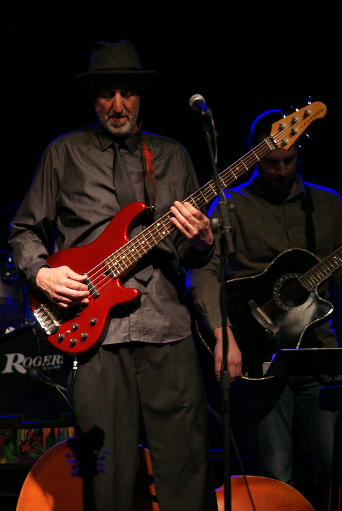
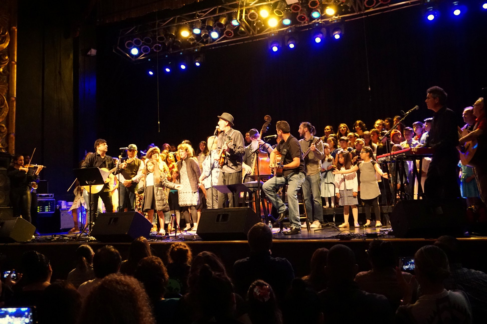
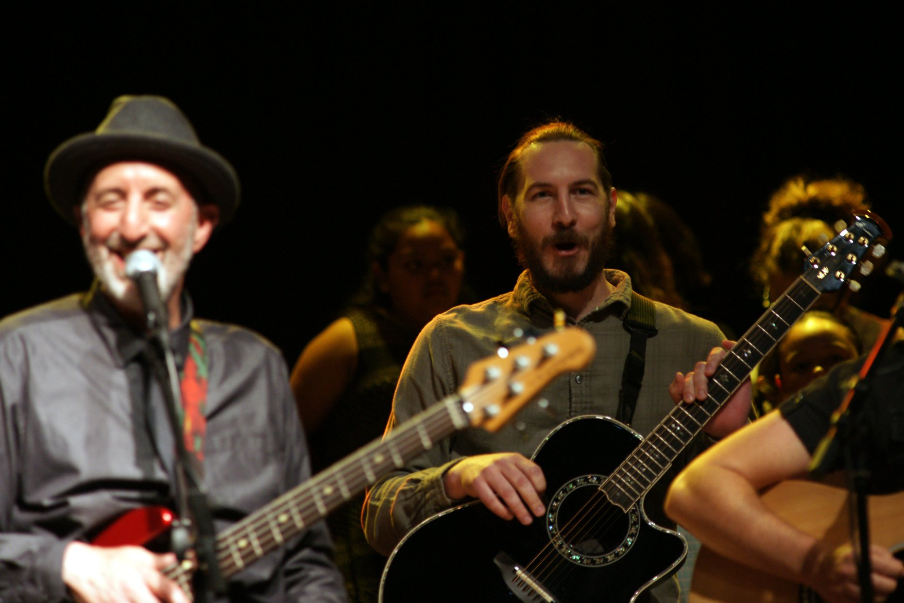

title: YoWutUpdate July 2019
tags:
- music
- education
- YoWutUpdate
- guitar
- Guitars Not Guns
- bottleflies
- mandolin
author: ''
date: 2019-07-22
---
[Guitars Not Guns Ohio](https://guitarsnotgunsohio.org/) has had a busy couple months. In April we [completed our second class](https://www.facebook.com/guitarsnotgunsohio/photos/rpp.1924379194556474/2319281625066227/?type=3&theater) with the Boys & Girls Club, this one at their Pheasant Run location in Reynoldsburg. In May we had [another successful benefit show](https://guitarsnotgunsohio.org/2019/05/21/2019-benefit-show-recap/), raising over $1,300 towards future classes and guitars for students. In June [WBNS-10TV did a feature on the chapter](https://www.10tv.com/article/local-non-profit-gives-kids-guitars-effort-prevent-gun-violence-2019-jul). And since then we've begun collaborating with several new organizations, hoping to soon have some classes scheduled for the fall.

These classes are only possible thanks to all our amazing volunteers. We're always looking for more volunteer guitar teachers, so if you or someone know might be interested please [reach out today](https://guitarsnotgunsohio.org/volunteer/). To learn more about what volunteering with GNG is like, check out [this blog post on my experience](https://guitarsnotgunsohio.org/2019/06/03/meet-the-volunteer-brian-cerney/).

<!--  -->

    

        

            
        

        

            
        

    

After a long hiatus and some false starts, [bottleflies](http://bottleflies.com) are back on the stage. Since [releasing our EPK](http://bottleflies.com/info.html) in March, we've [played](https://www.facebook.com/bottleflies/videos/vl.2328540820522851/1049637822092323/?type=1) a [couple shows](https://www.facebook.com/bottleflies/videos/vl.352841912047966/696895064104443/?type=1) at [CRAFT & VINYL](https://www.craft-n-vinyl.com/) plus [another at The Midden](https://soundcloud.com/bottleflies-band/sets/bottleflies-the-midden-4162019). 

<!--  -->

We're itching for more gigs, so if you've got any leads [let us know](mailto:bottlefliesband@gmail.com). In the meantime we've begun recording an album, check out our [Soundcloud](https://soundcloud.com/bottleflies-band) for updates.

<!--  -->

    

        

        

            
        

        

    

In June I had the honor of performing with Mr. Jim Rossi during his retirement concert at the Fox Theater in Salinas, CA. Mr. Rossi was my 2nd grade teacher and a musical mentor throughout my early life.

<!--  -->

    

        

            
        

        

            
        

    

It was a packed stage and a packed house there to celebrate Mr. Rossi. I joined to play "Hey Jude" (sung in Italian) and "We Are The World". It was a great time, and brought back a lot of fond memories from my time as a member of Mr. Rossi's Glee Club. A big thank you to Mr. Rossi for all his efforts in sharing the joy of music with Salinas students!

<!--  -->
